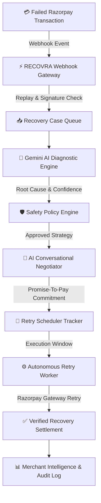

# ⚡ RECOVRA — Autonomous Payment Recovery Platform

> **Razorpay AI Buildathon 2026 Submission Edition**  
> *An Enterprise AI Engine for Automated Razorpay Payment Recovery, Safety Policy Guardrails, Conversational Customer Negotiation, and Merchant Intelligence.*

---

## 🌟 Executive Overview

In digital commerce, payment failures cause up to **30% revenue drop-off**. Traditional recovery mechanisms rely on naive, static retries that trigger issuing bank security lockouts or aggressive collection emails that alienate buyers.

**RECOVRA** solves this by introducing an **Autonomous AI Payment Recovery Engine** integrated with Razorpay. When a transaction fails:
1. **Real-Time Capture**: Razorpay webhooks intercept gateway failures immediately.
2. **AI Failure Diagnostics**: Google Gemini AI analyzes error logs, network latency, and issuing bank codes to determine root cause with a confidence score.
3. **Safety Policy Clearance**: Rule engines validate retry thresholds, velocity limits, and transaction guardrails.
4. **Conversational AI Negotiation**: An interactive chat agent engages customers, resolves issues, and schedules Promise-To-Pay (PTP) commitments.
5. **Autonomous Execution**: Background recovery workers execute retries outside bank peak hours.
6. **Immutable Audit Trail**: Every decision, policy check, and settlement is recorded in an append-only timeline.

---

## 🏗️ System Architecture



---

## 🚀 Key Features & Capabilities

### 1. Real-Time Failure Detection & Diagnosis
- Intercepts UPI, Card, Netbanking, and Wallet transaction failures via Razorpay webhooks.
- AI Diagnostic Engine (Gemini 1.5 Flash with `LOCAL_FALLBACK`) classifies failures into **BANK_NETWORK**, **INSUFFICIENT_FUNDS**, **AUTH_FAILED**, **EXPIRED_CARD**, or **SUSPICIOUS_RISK**.

### 2. Safety Policy Engine & Compliance Guardrails
- Validates 4 mandatory safety guardrail rules before executing recovery actions:
  - *Maximum Retry Threshold* (≤ 3 attempts)
  - *Transaction Amount Safety Ceiling*
  - *Bank Cooldown Hold* (Prevents secondary bank security blocks)
  - *Merchant Policy Alignment*

### 3. Conversational AI Negotiator & Promise-To-Pay Tracker
- Engages buyers via interactive dialogue to understand payment intent.
- Detects customer intents (`WILL_PAY_NOW`, `PROMISE_TO_PAY`, `NEEDS_MORE_TIME`, `DISPUTES_PAYMENT`).
- Registers Promise-To-Pay (PTP) dates and pauses retries until the customer's requested time.

### 4. Interactive Live Judge Demo Runner (`LiveDemoPlayer`)
- Built-in 90–120s automated showcase runner driving judges through the complete recovery lifecycle with Play, Pause, Replay, and Reset controls.

### 5. Enterprise Security & Audit Immutability
- **Row Level Security (RLS)**: Authenticated merchant-scoped policies (`auth.uid() = merchant_id`).
- **Persistent Webhook Replay Protection**: Webhook event IDs stored in PostgreSQL `webhook_events` table.
- **Append-Only Audit Logs**: Database trigger `prevent_audit_log_delete` ensures audit trails are immutable.

---

## 🛠️ Quick Start & Environment Setup

### Prerequisites
- **Node.js**: v18.0.0 or higher
- **Package Manager**: npm or yarn
- **Database**: Supabase PostgreSQL project

### 1. Clone & Install Dependencies
```bash
git clone https://github.com/your-org/recovra.git
cd recovra
npm install
```

### 2. Configure Environment Variables
Copy `.env.example` to `.env.local` and add your service credentials:
```bash
cp .env.example .env.local
```

Example `.env.local`:
```env
NEXT_PUBLIC_SUPABASE_URL=https://your-project.supabase.co
NEXT_PUBLIC_SUPABASE_ANON_KEY=your_anon_key
SUPABASE_SERVICE_ROLE_KEY=your_service_role_key

RAZORPAY_KEY_ID=rzp_test_xxxxxxxxxxxx
RAZORPAY_KEY_SECRET=xxxxxxxxxxxxxxxxxxxx
RAZORPAY_WEBHOOK_SECRET=your_webhook_secret

GEMINI_API_KEY=AIzaSyXXXXXXXXXXXXXXXXXX
NEXT_PUBLIC_APP_URL=http://localhost:3000
NODE_ENV=development
```

### 3. Run Database Migrations
Execute [`supabase/migrations/schema.sql`](file:///d:/RECOVRA/supabase/migrations/schema.sql) in your Supabase SQL Editor.

### 4. Launch Development Server
```bash
npm run dev
```
Open [http://localhost:3000](http://localhost:3000) in your browser.

---

## 🧪 Test Matrix & Quality Verification

RECOVRA includes an extensive automated end-to-end test suite:

```bash
# Run TypeScript compilation check
npx tsc --noEmit

# Run 105-Test Phase 11 Regression Matrix
npx tsx scripts/test-phase11-qa.ts

# Run Security & Environment Verification
npx tsx scripts/test-phase10d.ts
```

### Test Suite Results Summary
- **Total Validation Tests**: 105 / 105
- **Success Rate**: **100.0%**
- **TypeScript Compilation Errors**: **0**

---

## 📜 API Route Reference

| Endpoint | Method | Access Level | Description |
| :--- | :--- | :--- | :--- |
| `/api/payments/create-order` | `POST` | Authenticated | Creates Razorpay order for checkout |
| `/api/payments/verify` | `POST` | Authenticated | Verifies payment signature & updates status |
| `/api/webhooks/razorpay` | `POST` | Webhook Verified | Handles Razorpay webhook events |
| `/api/recovery` | `GET` | Authenticated | Fetches active recovery queue |
| `/api/recovery/[id]` | `GET` | Authenticated | Fetches single recovery case context |
| `/api/negotiator/message` | `POST` | Authenticated | Generates AI negotiation reply |
| `/api/demo/seed` | `POST` | Authenticated | 1-Click seeds 100 realistic records |
| `/api/admin/snapshot` | `GET` | Admin Auth | Exports system database metadata |
| `/api/health` | `GET` | Public | System health check (exposes zero secrets) |

---

## ⚖️ Honest Disclosures & Test Mode Specifications

- **Razorpay Integration**: All checkout flows and payment verification signatures execute in **Razorpay Test Mode (Sandbox)**.
- **AI Diagnostics**: AI analysis utilizes **Gemini 1.5 Flash** with an automatic deterministic fallback (`LOCAL_FALLBACK`) if Gemini API quotas are exceeded.
- **Production Guardrails**: The `/api/demo/reset` endpoint is disabled when `NODE_ENV === "production"`.

---

## 📄 License

RECOVRA is released under the **MIT License**. Created for the **Razorpay AI Buildathon 2026**.
